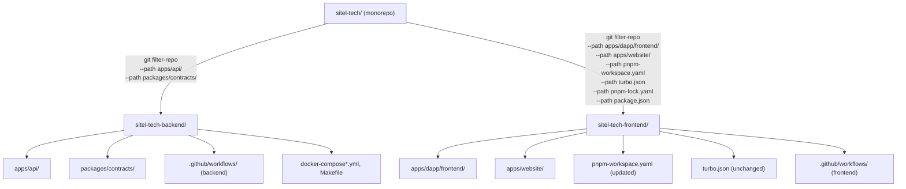

# Design Document — monorepo-split

## Overview

The goal is to split the `sitel-tech/` pnpm/Turborepo monorepo into two standalone Git repositories:

- **sitel-tech-backend** — Go API (`apps/api/`) + Rust smart contracts (`packages/contracts/`)
- **sitel-tech-frontend** — Next.js dapp (`apps/dapp/frontend/`), marketing/docs website (`apps/website/`), pnpm workspace config, and Turborepo config

The split is executed with `git filter-repo`, which rewrites history in place, keeping only the commits that touched the files assigned to each partition. Both repositories must be fully self-contained: installable, buildable, and CI-green on their first push without any changes to source code.

### Key Constraints

- **Git history preserved** in both repos — `git log` and `git blame` remain useful.
- **No cross-repository `workspace:*` dependencies** — each repo installs independently.
- **Frontend CI pipeline stays fully operational** — change detection, build, lint, test, E2E, security, SBOM, staging deploy.
- **Backend CI pipeline stays fully operational** — Go build/test, Rust build/test, security, SBOM, staging deploy.
- **E2E tests in sitel-tech-frontend run against the deployed staging backend** — no local docker-compose for PR-level frontend E2E.
- **apps/website stays in sitel-tech-frontend**.
- **No `workspace:*` dependency from dapp or website on `packages/contracts`** exists today (confirmed by reviewing `apps/dapp/frontend/package.json` and `apps/website/package.json`); no npm package extraction is required.

---

## Architecture

The split is a one-time migration operation, not a long-running service. The deliverable is a migration script (`scripts/split-repo.sh`) plus updated config files for each target repo.



### Migration Phases

1. **Audit** — Scan for cross-repo dependencies (workspace:* refs, path deps in Cargo.toml) and produce a migration checklist.
2. **Filter** — Run `git filter-repo` to produce two bare clone candidates.
3. **Patch** — Apply post-filter patches: update `pnpm-workspace.yaml`, split workflow files, update path references.
4. **Verify** — Run the automated verification suite against both output directories.
5. **Publish** — Push each filtered repo to its new GitHub remote.

---

## Components and Interfaces

### 1. Split Script (`scripts/split-repo.sh`)

A bash script that orchestrates all five migration phases. It takes no arguments and reads configuration from environment variables for the target remote URLs.

**Responsibilities:**
- Clone the monorepo to two scratch directories
- Run `git filter-repo` on each clone with the correct path set
- Apply workspace config patches to the frontend clone
- Copy the split workflow files from the prepared `.github/` directories
- Run the verification suite
- Print the migration checklist

**Dependencies:** `git`, `git-filter-repo` (Python, pip-installable), `python3`, `pnpm`, `jq`

### 2. sitel-tech-backend Repository Layout

```
sitel-tech-backend/
├── apps/
│   └── api/                  # Go API (unchanged)
├── packages/
│   └── contracts/            # Rust contracts (unchanged)
├── docker-compose.yml        # (moved from monorepo root)
├── docker-compose.external.yml
├── docker-compose.override.yml
├── docker-compose.signer.yml
├── Makefile                  # (moved from monorepo root, backend targets only)
├── scripts/
│   ├── contract-audit.sh
│   ├── validate_vulnignore.py
│   └── verify_migrations.go  # (from apps/api/scripts/)
├── tests/
│   ├── load/                 # k6 load scripts
│   └── probes/               # synthetic probes (Python)
├── docker/                   # Prometheus/Grafana/Alertmanager configs
│   ├── prometheus/
│   ├── alertmanager/
│   └── grafana/
├── .github/
│   ├── workflows/
│   │   ├── ci.yml
│   │   ├── security.yml
│   │   ├── deploy-staging.yml
│   │   ├── contract-audit.yml
│   │   ├── api-property-nightly.yml
│   │   ├── contracts-property-nightly.yml
│   │   ├── load-soak.yml
│   │   ├── synthetic-probes.yml
│   │   └── dependabot-auto-merge.yml
│   ├── security-scanner-versions.env
│   ├── dependabot.yml
│   └── CODEOWNERS
├── .vulnignore
├── .gitleaks.toml
├── .gitleaksignore
└── README.md
```

**Root-level files moved from the monorepo:** `Makefile`, `docker-compose*.yml`, `docker/`, `scripts/contract-audit.sh`, `scripts/validate_vulnignore.py`, `.vulnignore`, `.gitleaks.toml`, `.gitleaksignore`.

### 3. sitel-tech-frontend Repository Layout

```
sitel-tech-frontend/
├── apps/
│   ├── dapp/
│   │   └── frontend/         # Next.js dapp (unchanged)
│   └── website/              # Next.js website (unchanged)
├── pnpm-workspace.yaml       # Updated: only frontend paths
├── turbo.json                # Unchanged
├── package.json              # Updated: only frontend scripts/devDeps
├── pnpm-lock.yaml            # Regenerated after workspace update
├── .github/
│   ├── workflows/
│   │   ├── ci.yml
│   │   ├── security.yml
│   │   ├── deploy-staging.yml
│   │   ├── e2e-testnet-nightly.yml
│   │   └── dependabot-auto-merge.yml
│   ├── dependabot.yml
│   └── CODEOWNERS
├── .nvmrc
├── .coderabbit.yaml
└── README.md
```

### 4. Workflow File Split

The monorepo has a single large `ci.yml` with jobs for all languages. After the split, each repo gets its own `ci.yml` containing only the jobs relevant to it.

| Job (monorepo ci.yml) | Destination |
|---|---|
| `changes` | Both (each has its own change detection with repo-scoped paths) |
| `website` | sitel-tech-frontend |
| `dapp-frontend` | sitel-tech-frontend |
| `dapp-e2e` | sitel-tech-frontend |
| `slo` | sitel-tech-backend |
| `security` (JS parts) | sitel-tech-frontend |
| `security` (Go/Rust parts) | sitel-tech-backend |
| `api` | sitel-tech-backend |
| `contracts` | sitel-tech-backend |
| `sbom` | Both (each repo generates SBOM for its own stack) |

**Workflows that go entirely to sitel-tech-backend:** `contract-audit.yml`, `api-property-nightly.yml`, `contracts-property-nightly.yml`, `load-soak.yml`, `synthetic-probes.yml`

**Workflows that go entirely to sitel-tech-frontend:** `e2e-testnet-nightly.yml`

**Workflows duplicated/adapted in both repos:** `security.yml`, `deploy-staging.yml`, `dependabot-auto-merge.yml`

### 5. Path Reference Updates

All workflow files must have their hard-coded paths updated after the split. The following path rewrite table applies:

| Original path | sitel-tech-frontend path | sitel-tech-backend path |
|---|---|---|
| `apps/dapp/**` | `apps/dapp/**` (unchanged) | *removed* |
| `apps/website/**` | `apps/website/**` (unchanged) | *removed* |
| `apps/api/**` | *removed* | `apps/api/**` (unchanged) |
| `packages/contracts/**` | *removed* | `packages/contracts/**` (unchanged) |
| `apps/dapp/frontend/.next/` | `apps/dapp/frontend/.next/` | *removed* |
| `apps/dapp/frontend/playwright-report/` | `apps/dapp/frontend/playwright-report/` | *removed* |

### 6. pnpm-workspace.yaml Update

Current:
```yaml
packages:
  - 'apps/*'
  - 'apps/dapp/frontend'
  - 'packages/*'
```

After split (sitel-tech-frontend):
```yaml
packages:
  - 'apps/dapp/frontend'
  - 'apps/website'
```

The `'apps/*'` glob is removed because `apps/dapp` itself is not a workspace package (only `apps/dapp/frontend` is). The `'packages/*'` glob is removed because `packages/contracts` moves to sitel-tech-backend and there are no other packages.

### 7. Dependabot Configuration Updates

sitel-tech-frontend `.github/dependabot.yml`:
```yaml
version: 2
updates:
  - package-ecosystem: npm
    directory: /apps/dapp/frontend
    schedule:
      interval: daily
    open-pull-requests-limit: 0
  - package-ecosystem: github-actions
    directory: /
    schedule:
      interval: daily
    open-pull-requests-limit: 0
```

sitel-tech-backend `.github/dependabot.yml`:
```yaml
version: 2
updates:
  - package-ecosystem: gomod
    directory: /apps/api
    schedule:
      interval: daily
    open-pull-requests-limit: 0
  - package-ecosystem: cargo
    directory: /packages/contracts
    schedule:
      interval: daily
    open-pull-requests-limit: 0
  - package-ecosystem: github-actions
    directory: /
    schedule:
      interval: daily
    open-pull-requests-limit: 0
```

### 8. Staging E2E Configuration

The PR-level `dapp-e2e` job in `sitel-tech-frontend/ci.yml` is self-contained: it uses `next dev` on port 3001 with route interception and does not require a live backend. This is unchanged from the monorepo.

The nightly `e2e-testnet-nightly.yml` workflow (deposit/withdraw journey) already reads `STAGING_URL` from a repo variable, so it naturally points to the independently deployed backend staging endpoint after the split. The `NEXT_PUBLIC_API_URL` / `NEXT_PUBLIC_WS_URL` env vars in `build-dapp` (deploy-staging.yml) must be set to the backend staging URL.

---

## Data Models

The split operation itself has no runtime data model. The relevant data structures are the configuration files that change:

### pnpm-workspace.yaml (sitel-tech-frontend)
```typescript
// Logical model
interface PnpmWorkspace {
  packages: string[]; // glob patterns, all must resolve to directories in sitel-tech-frontend
}
// After split: ['apps/dapp/frontend', 'apps/website']
```

### Migration Checklist (output artifact)
```
## sitel-tech-frontend Secrets
- SEMGREP_APP_TOKEN
- SMOKE_TEST_WALLET_SECRET
- STAGING_DEPLOY_TOKEN
- SLACK_DEPLOYMENT_WEBHOOK
- TESTNET_WALLET_ADDRESS (nightly E2E)

## sitel-tech-frontend Variables
- STAGING_API_URL
- STAGING_WS_URL
- STAGING_URL
- VAULT_ID (nightly E2E)

## sitel-tech-backend Secrets
- STAGING_DEPLOY_TOKEN
- X402_PAYMENT_PROOF (contract-audit)
- STAGING_PROBE_API_BASE_URL (synthetic-probes)
- STAGING_PROBE_AUTH_TOKEN
- STAGING_PROBE_VAULT_ID
- STAGING_PROBE_ALLOW_MUTATIONS (variable)
- STAGING_PUSHGATEWAY_URL
- STAGING_PUSHGATEWAY_AUTH
- STAGING_LOAD_API_BASE_URL (load-soak)
- STAGING_LOAD_WS_URL
- STAGING_LOAD_VAULT_ID
- STAGING_LOAD_AUTH_TOKEN

## sitel-tech-backend Variables
- CONTRACT_AUDIT_ADDRESSES
- CONTRACT_AUDIT_API_URL
- STAGING_PROBE_AMOUNT

## WASM / contracts → npm dependency check
Result: No workspace:* references to packages/contracts found in
apps/dapp/frontend/package.json or apps/website/package.json.
No npm package extraction required.
```

### File Partition Map
The split script produces an explicit partition map used by the verification suite:

```
backend_paths = {
  "apps/api/**",
  "packages/contracts/**",
  "docker-compose*.yml",
  "docker/",
  "Makefile",
  "scripts/contract-audit.sh",
  "scripts/validate_vulnignore.py",
  "tests/load/",
  "tests/probes/",
  ".vulnignore",
  ".gitleaks.toml",
  ".gitleaksignore"
}

frontend_paths = {
  "apps/dapp/frontend/**",
  "apps/website/**",
  "pnpm-workspace.yaml",
  "turbo.json",
  "package.json",
  "pnpm-lock.yaml",
  ".nvmrc",
  ".coderabbit.yaml"
}
```

Files not in either partition (e.g. `PRD.md`, root `README.md`) are copied to both repos without history (documentation).

---

## Correctness Properties

*A property is a characteristic or behavior that should hold true across all valid executions of a system — essentially, a formal statement about what the system should do. Properties serve as the bridge between human-readable specifications and machine-verifiable correctness guarantees.*

Property-based testing applies here because several of the verification checks are universal invariants over sets of files, paths, and commits — not single examples. The property-based test library for this feature is **Hypothesis** (Python), since the migration verification script is in Python and `git filter-repo` is already a Python tool.

### Property 1: Repository File Disjointness

*For any* two files, one drawn from the set of all file paths in `sitel-tech-backend` and one from `sitel-tech-frontend`, the two paths SHALL be different — i.e., the intersection of the two file path sets is empty.

**Validates: Requirements 1.4**

---

### Property 2: Commit Partition Purity

*For any* commit in either output repository, that commit SHALL NOT have a non-empty diff that exclusively touches files belonging to the opposite partition. (Commits touching files in both partitions, or only in the shared documentation set, are exempt.)

**Validates: Requirements 2.3**

---

### Property 3: Frontend Workspace Path Validity

*For any* path entry declared in `sitel-tech-frontend/pnpm-workspace.yaml`, that path SHALL resolve to a directory that exists within the `sitel-tech-frontend` file tree AND SHALL NOT match any backend path pattern (`apps/api/**`, `packages/contracts/**`).

**Validates: Requirements 4.1, 4.2, 7.1**

---

### Property 4: Workflow Path Cross-Contamination Absence

*For any* file path string literal appearing in any workflow YAML file in `sitel-tech-frontend/.github/workflows/`, that path SHALL NOT match a backend path pattern (e.g. `apps/api/`, `packages/contracts/`). Similarly, *for any* file path string literal in `sitel-tech-backend/.github/workflows/`, it SHALL NOT match a frontend path pattern (e.g. `apps/dapp/`, `apps/website/`, `pnpm`, `node_modules`).

**Validates: Requirements 5.3, 5.4, 5.5, 5.6**

---

### Property 5: Secrets Checklist Completeness

*For any* `${{ secrets.X }}` reference found in any workflow YAML file in `sitel-tech-frontend/.github/workflows/`, the identifier X SHALL appear in the `sitel-tech-frontend` section of the migration checklist. The same holds for `sitel-tech-backend`.

**Validates: Requirements 6.1, 6.2**

---

### Property 6: No Cross-Repository Workspace Dependencies

*For any* `package.json` file found anywhere in `sitel-tech-frontend/`, no dependency entry SHALL have a value equal to `workspace:*` that resolves to a package name owned by `sitel-tech-backend` (i.e. `@sitel-tech/contracts` or any scoped name derived from `packages/contracts`). Conversely, `sitel-tech-backend` SHALL contain no `pnpm-workspace.yaml` file and no `package.json` whose `name` matches a frontend package.

**Validates: Requirements 7.1, 7.2, 7.3**

---

## Error Handling

### Pre-flight Checks (script aborts with descriptive error)

| Condition | Error Message |
|---|---|
| `git filter-repo` not installed | `ERROR: git-filter-repo is not installed. Run: pip install git-filter-repo` |
| Working tree has uncommitted changes | `ERROR: Uncommitted changes detected. Commit or stash before running the split.` |
| Output directory already exists | `ERROR: Output directory {sitel-tech-backend,sitel-tech-frontend}/ already exists. Delete it first.` |
| `pnpm` not in PATH | `ERROR: pnpm is not installed or not in PATH.` |

### Post-filter Verification Failures

If any correctness property fails, the script prints which property failed, the offending file(s), and exits non-zero. The output repos are left on disk so the operator can inspect them.

### Secrets Present in Workflow but Not in Checklist

The verification step parses all workflow YAMLs with a regex for `secrets\.[A-Z0-9_]+`, compares to the checklist, and prints a `WARNING: Secret XYZ referenced in workflow but missing from checklist` message. This is non-fatal (the checklist is generated, not manually maintained) but prompts review.

### WASM / npm Dependency Flag

If `scripts/scan_workspace_deps.py` detects any `workspace:*` reference to `packages/contracts` in a frontend package.json, it prints:

```
FLAGGED: apps/dapp/frontend/package.json depends on packages/contracts via workspace:*.
Proposed remediation: publish contracts/bindings as a versioned npm package
(e.g. @sitel-tech/contracts-wasm@x.y.z) or use a git submodule.
```

The split halts until the operator resolves or explicitly bypasses the flag.

---

## Testing Strategy

### Unit Tests

Unit tests cover the Python helper functions used by the split script and verification suite:

- `parse_workflow_paths(yaml_content: str) -> list[str]` — extracts all file path strings from a workflow YAML
- `parse_workflow_secrets(yaml_content: str) -> set[str]` — extracts all `secrets.X` identifiers
- `paths_are_disjoint(set_a: set[str], set_b: set[str]) -> bool` — set intersection check
- `path_matches_pattern(path: str, patterns: list[str]) -> bool` — glob matching

These are pure functions, making them straightforward to unit test with example inputs.

### Property-Based Tests (Hypothesis)

Property tests run the above functions against generated inputs to verify the universal properties defined in the Correctness Properties section. Minimum 100 iterations per property.

**Feature: monorepo-split, Property 1: Repository File Disjointness**
Generate random sets of file paths partitioned into two groups. Assert `paths_are_disjoint` returns True when there is no overlap, and False when there is.

**Feature: monorepo-split, Property 3: Frontend Workspace Path Validity**
Generate random pnpm-workspace.yaml contents with varying path patterns. Assert the validator correctly identifies backend paths (`apps/api/`, `packages/contracts/`) and flags them.

**Feature: monorepo-split, Property 4: Workflow Path Cross-Contamination Absence**
Generate random workflow YAML strings containing a mix of frontend and backend path strings. Assert the scanner correctly identifies cross-contamination.

**Feature: monorepo-split, Property 5: Secrets Checklist Completeness**
Generate random workflow YAML content with varying `${{ secrets.X }}` references. Assert that `parse_workflow_secrets` extracts all of them and none are missed.

**Feature: monorepo-split, Property 6: No Cross-Repository Workspace Dependencies**
Generate random package.json contents with varying dependency maps including `workspace:*` values. Assert the scanner flags those referencing known backend package names.

### Integration Tests

Run after the split script completes on the actual repository:

1. **File disjointness check** — enumerate real file paths in both output repos, assert empty intersection.
2. **Git history smoke** — for 5 representative files per repo, assert `git log --oneline <file>` returns ≥ 1 line.
3. **pnpm install dry-run** — run `pnpm install --frozen-lockfile --dry-run` in `sitel-tech-frontend/`.
4. **Go build smoke** — run `go build ./...` in `sitel-tech-backend/apps/api/`.
5. **Cargo check** — run `cargo check --target wasm32-unknown-unknown` in `sitel-tech-backend/packages/contracts/`.
6. **Workflow YAML validity** — run `actionlint` against both repos' `.github/workflows/`.

### Testing Library

- **Unit + Property tests:** `pytest` + `hypothesis` (Python 3.12)
- **YAML linting:** `actionlint` (Go, pre-built binary)
- **Path assertions:** Python `pathlib` + `fnmatch`
